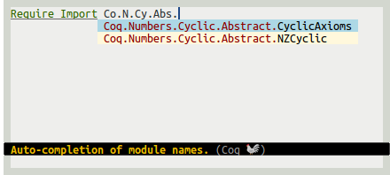
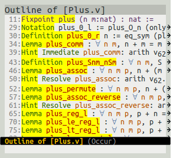
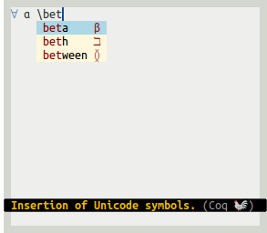
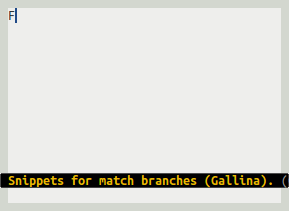
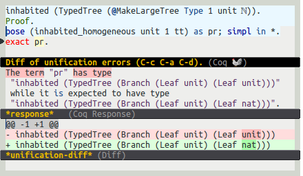

# company-coq

Company backend for Proof-General's Coq mode. Setup should be pretty straightforward, although the
most advanced features require a patched version of coqtop.

## Features

### Completion

* Auto-completion of [math symbols](img/tactic-completion-doc.png) (using company-math)

* Auto-completion of theorems and tactics defined in the same buffer, with type annotations.

* Easy access to [Proof-General's templates](img/lemma-completion.png) (using yasnippet), with smart templates for sections and modules.

* Auto-completion of (most of) Coq's [tactics](img/command-completion-doc.png) and
  [commands](img/symbol-completion-doc.png), with snippets auto-extracted from the manual.

* Fuzzy auto-completion of [module names](img/module-completion.png) in `Import` commands.

* Auto-completion of [identifiers](img/identifiers-completion.png) in proof contexts, and of section and modules names.

### Proof-General Extensions

* [Documentation](img/keyword-completion-doc.png) for (most) auto-completion entries, with excerpts
  from the manual shown directly in Emacs.

* Interactive [proof script outline](img/outline.png) and [in-buffer folding](img/folding.png)

* Basic project search (search for instances of the word at point in neighboring files)

* Interactive lemma extraction: press <kbd>C-c C-a C-e</kbd> to extract the current goal into a separate lemma.

* Extended [font beautification](img/prettify.png): keywords are automatically replaced with corresponding symbols (`⊢⊤⊥→⇒λ∀∃∧∨¬≠⧺𝓝ℤℕℚℝ𝔹𝓟`)

* Visual [word diff](img/unification.png) of large unification error messages (<samp>The term "<i>blah</i>" has type "<i>huge blob</i>" while it is expected to have type "<i>slightly different blob</i>"</samp>)

* Convenient snippets: easily insert [new `match` cases](img/match-function.gif) and [`match goal` rules](img/match-goal.gif).

### Advanced features

(These require a [patched version](https://github.com/coq/coq/pull/56) of `coqtop`)

* Auto-completion of all known [theorem and symbol names](img/symbol-completion-doc.png), with
  [type annotations](img/symbol-completion.png).

## Screenshots

### Autocompletion of tactics with documentation


### Autocompletion of commands with documentation


### Auto insertion of Proof-General's templates


### Fuzzy autocompletion of module names



### Auto-completion of identifiers


### Outline and folding




### Unicode math symbols



### Keyword beautification


### Neat snippets




### Diffs of unification errors



### Autocompletion of symbol names (w/ patched `coqtop`, see notes)


(notice the help string in the mini-buffer)


## Setup

Note: You need a version of Emacs >= 24 for this to work properly. You can check which version you are running with <kbd>M-x emacs-version RET</kbd>

### Coq

```bash
sudo apt-get install coq
```

### Proof-General

```bash
sudo apt-get install proof-general
```

(or [from source](http://proofgeneral.inf.ed.ac.uk/releases/ProofGeneral-4.2.tgz))

### company-coq

`company-coq` is on [MELPA](http://melpa.org/#/getting-started). First add the following to your `.emacs` and restart emacs.

```elisp
(require 'package)
(add-to-list 'package-archives '("melpa" . "http://melpa.org/packages/") t)
(package-initialize)
```

Then type `M-x package-refresh-contents RET` followed by `M-x package-install RET company-coq RET` to install and byte-compile `company-coq` and its dependencies. Some of them will produce a few warnings. That's ok.

## Configuration

Add the following to your `.emacs`

```elisp
(package-initialize)

;; Open .v files with Proof-General's coq-mode
(require 'proof-site)

;; Load company-coq when opening Coq files
(add-hook 'coq-mode-hook #'company-coq-initialize)
```

## Quick start guide

`company-coq` should be pretty transparent. Completion windows will pop up when `company-coq` has suggestions to make. By default, this would be when you start writing a tactic name or a command. You can also launch manual completion by using <kbd>C-RET</kbd> (or whatever was originally assigned to `proof-script-complete` in Coq mode).

Once auto-completion has started, the following key bindings are available:

* <kbd>RET</kbd> selects a completion
* <kbd>C-g</kbd> interrupts completion.
* <kbd>C-h</kbd> and <kbd>&lt;f1></kbd> display documentation for the currently highlighted keyword or identifier.
* <kbd>C-M-v</kbd> scrolls down in the documentation window.
* <kbd>C-w</kbd> opens the relevant section of the documentation, scrolling to the part about the currently highlighted keyword or identifier. Using <kbd>C-w</kbd> allows you scroll up (<kbd>C-M-S-v</kbd>) in the documentation window to see more context.

Selecting a completion often inserts a snippet with holes at the current point (`company-coq` uses `yasnippet` as the snippet backend). You can move between holes by using <kbd>&lt;tab></kbd> and <kbd>S-&lt;tab></kbd>.

Loading `company-coq` also binds the following keys:

* <kbd>M-RET</kbd> inserts a new `match` case (`| _ => _`).
* <kbd>M-S-RET</kbd> inserts a new `match goal` rule (`| [ H: _ |- _ ] => _`).
* <kbd>C-c C-a C-e</kbd> extracts the current goal into a separate lemma.
* <kbd>C-c C-,</kbd> opens an outline of the code in a separate buffer (using `occur`).
* <kbd>C-c C-/</kbd> folds the current code block, or all blocs in the file if repeated.
* <kbd>C-c C-\\</kbd> unfolds the current code block, or all blocs in the file if repeated.
* <kbd>C-c C-&</kbd> looks up (grep) the current word in files in the current directory subtree.

## Troubleshooting

### Empty squares in place of math operators, or incorrect line spacing

If you see blank squares appear where there should be math symbols (`forall`, `exists`, etc.), or if some lines suddenly become very tall, you may be missing a proper math font. See [Installing a math-enabled font](#math-font), or insert the following snippet in your .emacs to disable symbols beautification:

```elisp
;; Disable keyword replacement
(setq company-coq-prettify-symbols nil)
```

Technical note: Proof-General [also offers](http://proofgeneral.inf.ed.ac.uk/htmlshow.php?title=Proof+General+user+manual+%28latest+release%29&file=releases%2FProofGeneral-latest%2Fdoc%2FProofGeneral%2FProofGeneral_5.html#Unicode-Tokens-mode) a Unicode keywords facility. `company-coq`'s implementation is based on the `prettify-symbols-mode` facility found in Emacs 24.4+, yielding a more compact (and faster?) implementation.

## Advanced topics

### Installing a math-enabled font {#math-font}

For font beautification to work properly, you'll need a font with proper symbol support. DejaVu Sans Mono, Symbola, FreeMono, STIX, Unifont, Segoe UI Symbol, Arial Unicode and Cambria Math do. If Emacs doesn't fallback properly, you can use the following snippet:

```elisp
(set-fontset-font "fontset-default" 'unicode (font-spec :name "Symbola") nil)
```

### Registering your own symbols and math operators

Adjust and use the following snippet to register your own keywords to prettify:

```elisp
(add-hook 'coq-mode-hook
          (lambda ()
            (setq-local prettify-symbols-alist
                        '((":=" . ?≜) ("Proof." . ?∵) ("Qed." . ?■)
                          ("Defined." . ?□) ("Time" . ?⏱)))))
```

### Autocompleting more symbols

The procedure above will give you auto-completion and documentation for tactics, commands, and theorems that you define locally, but not for theorem names and symbols defined in the libraries you load. To get the latter, add the following to your `.emacs`, before `(company-coq-initialize)`:

```elisp
(setq company-coq-autocomplete-symbols-dynamic t)
```

This feature won't work well unless you build and use a patched coq REPL. [This patch](https://github.com/cpitclaudel/company-coq/blob/master/SearchMinimal.patch) should work well for 8.4pl2 and pl3; [this one](https://github.com/cpitclaudel/company-coq/blob/master/SearchMinimal-trunk.patch) should work on 8.5 and trunk.

### Disabling some modules

Modules, context and symbols auto-completion can be turned off using the following lines

```elisp
(setq company-coq-autocomplete-modules nil)
(setq company-coq-autocomplete-context nil)
(setq company-coq-autocomplete-symbols nil)
```

You can set these variables using `M-x customize-group RET company-coq RET

### Disabling company-coq

`M-x unload-feature RET company-coq RET` should work fine.

### Installing from source

#### Setup

[MELPA](http://melpa.org/#/getting-started)

#### company-coq

```bash
mkdir -p ~/.emacs.d/lisp/
git clone https://github.com/cpitclaudel/company-coq.git ~/.emacs.d/lisp/company-coq
cd ~/.emacs.d/lisp/company-coq
make package && make install
```

#### Configuration

```elisp
(add-to-list 'load-path "~/.emacs.d/lisp/company-coq/")
(require 'company-coq)
```
