# Company-coq

A collection of extensions for Proof General's Coq mode.

See screenshots below, or jump right to [setup instructions](#setup) and try the tutorial with `M-x company-coq-tutorial` after setting up!

## Setup

### Proof-General

Preferably for [GitHub](https://github.com/ProofGeneral/PG). Alternatively,

```bash
sudo apt-get install proof-general
```

### company-coq

`company-coq` is on [MELPA](http://melpa.org/#/getting-started). First add the following to your `.emacs` and restart emacs.

```elisp
(require 'package)
(add-to-list 'package-archives '("melpa" . "http://melpa.org/packages/") t)
(package-initialize)
```

Then type `M-x package-refresh-contents RET` followed by `M-x package-install RET company-coq RET` to install and byte-compile `company-coq` and its dependencies. Some of them will produce a few warnings. That's ok.

## Configuration

Add the following to your `.emacs`

```elisp
(package-initialize)

;; Open .v files with Proof-General's coq-mode
(require 'proof-site)

;; Load company-coq when opening Coq files
(add-hook 'coq-mode-hook #'company-coq-mode)
```

## Quick start guide

*You can check out the interactive tutorial by pressing `M-x company-coq-tutorial RET`.*

`company-coq` should be pretty transparent. Completion windows will pop up when `company-coq` has suggestions to make. By default, this would be when you start writing a tactic name or a command. You can also launch manual completion by using <kbd>C-RET</kbd> (or whatever was originally assigned to `proof-script-complete` in Coq mode).

Once auto-completion has started, the following key bindings are available:

* <kbd>RET</kbd> selects a completion
* <kbd>C-g</kbd> interrupts completion.
* <kbd>C-h</kbd> and <kbd>&lt;f1></kbd> display documentation for the currently highlighted keyword or identifier.
* <kbd>C-M-v</kbd> scrolls down in the documentation window.
* <kbd>C-w</kbd> opens the full documentation, scrolled to the current keyword. For symbols, <kbd>C-w</kbd> opens source view.

Selecting a completion often inserts a snippet with holes at the current point (`company-coq` uses `yasnippet` as the snippet backend). You can move between holes by using <kbd>&lt;tab></kbd> and <kbd>S-&lt;tab></kbd>. Some snippets (like Print Instances) include multiple choices.

Loading `company-coq` also binds the following keys:

* <kbd>M-RET</kbd> inserts a new `match` case (`| _ => _`).
* <kbd>M-S-RET</kbd> inserts a new `match goal` rule (`| [ H: _ |- _ ] => _`).
* <kbd>C-c C-a C-x</kbd> extracts the current goal into a separate lemma.
* <kbd>C-c C-a C-e</kbd> tries to match the last output to a documented error message, and displays the relevant section of the manual if it finds one.
* <kbd>C-down-mouse-1</kbd> (i.e. <kbd>C-click</kbd>) shows an inline quick help box for the symbol under point. The box disappears when the mouse is released. Pressing the <kbd>&lt;menu></kbd> key also works.
* <kbd>C-c C-,</kbd> opens an outline of the code in a separate buffer (using `occur`).
* <kbd>C-c C-/</kbd> folds the current code block, or all blocs in the file if repeated.
* <kbd>C-c C-\\</kbd> unfolds the current code block, or all blocs in the file if repeated.
* <kbd>C-c C-&</kbd> looks up (grep) the current word in files in the current directory subtree.
* <kbd>M-x company-coq-diff-unification-error</kbd> parses the last unification error, and shows a diff of the two types that can't unify.

## Tips

* Most completion engines support fuzzy matching: you can type `Require Import C.N..Ab.ZPa` and press <kbd>RET</kbd> to insert `Coq.Numbers.Integer.Abstract.ZParity`, and typing `setrewin` is enough to insert <code>setoid_rewrite <i>term</i> in <i>ident</i></code>. You can (and must) omit spaces: `SLD` will insert `Set Ltac Debug` (of course `SetLtDeb` will also work), and `ULD` will insert `Unset Ltac Debug`.
* Using <kdb>M-S-RET</kbd> to insert new cases in a `match goal` saves a lot of time (and finger contortions).
* The point-and-click feature (quick help) also works in non-graphic mode, if you enable `xterm-mouse-mode`.
* `company-coq` improves on some of Proof-General's features. Try <kbd>C-c C-a RET nat RET</kbd>.

`company-coq` is implemented as a collection of small modules implementing independent features; check out `M-x customize-variable RET company-coq-disabled-features RET` and `M-x customize-group RET company-coq RET` for more info!

## Screenshots

#### Prettification of operators and types

 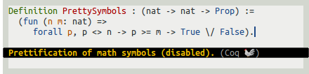

#### Auto-completion

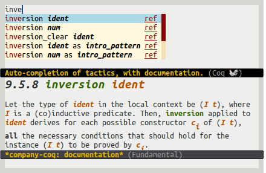 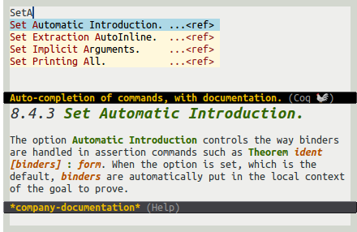

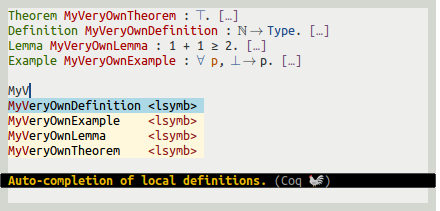 

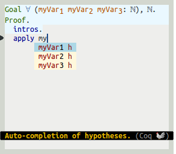 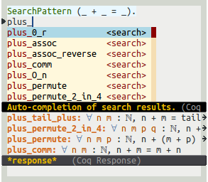 

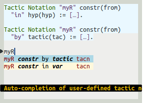 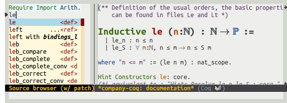

#### Snippets and smart commands


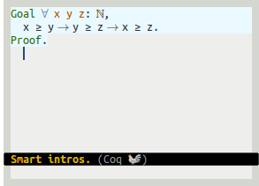

#### Outlines and code folding

 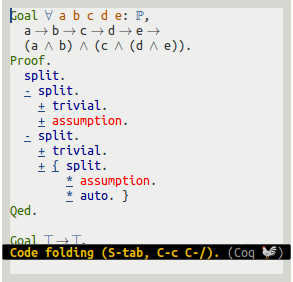

#### Help with errors

 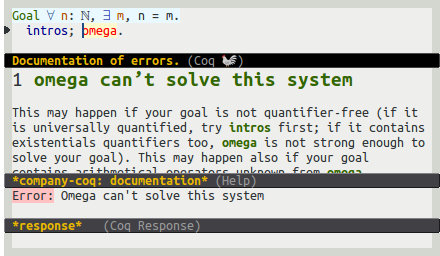

#### Misc. extensions of Proof General

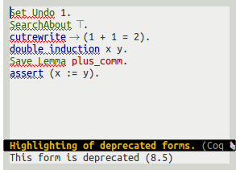 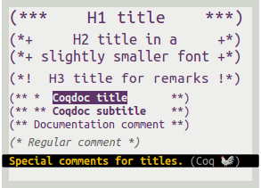 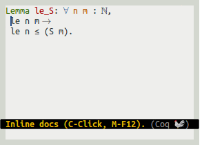

## Troubleshooting

### Empty squares in place of math operators, or incorrect line spacing

If you see blank squares appear where there should be math symbols (`forall`, `exists`, etc.), or if some lines suddenly become very tall, you may be missing a proper math font. See [Installing a math-enabled font](#installing-a-math-enabled-font), or insert the following snippet in your .emacs to disable symbols beautification:

```elisp
;; Disable keyword replacement
(setq company-coq-prettify-symbols nil)
```

Technical note: Proof-General [also offers](http://proofgeneral.inf.ed.ac.uk/htmlshow.php?title=Proof+General+user+manual+%28latest+release%29&file=releases%2FProofGeneral-latest%2Fdoc%2FProofGeneral%2FProofGeneral_5.html#Unicode-Tokens-mode) a Unicode keywords facility. `company-coq`'s implementation is based on the `prettify-symbols-mode` facility found in Emacs 24.4+, yielding a more compact (and faster?) implementation.

## Advanced topics

### Installing a math-enabled font

For font beautification to work properly, you'll need a font with proper symbol support. [Symbola](http://users.teilar.gr/~g1951d/Symbola.zip), FreeMono, STIX Math, Segoe UI Symbol, Latin Modern, and Cambria Math will all work. If Emacs doesn't fallback properly, you can use the following snippet:

```elisp
(set-fontset-font t 'unicode (font-spec :name "Symbola") nil 'append)
```

#### Fixing math indentation

Using a variable-width font for symbols will break indentation. See [this other project of mine](https://github.com/cpitclaudel/monospacifier#pre-monospacified-fonts-monospace-fonts-with-good-unicode-coverage) to download a monospace-friendly symbols font. You'll want to add (or replace) the following snippet (adjusting `Symbola` and `DejaVu sans Mono` as appropriate):

```elisp
(set-fontset-font t 'unicode (font-spec :name "Symbola monospacified for DejaVu Sans Mono") nil 'append)
```

### Registering your own symbols and math operators

Adjust and use the following snippet to register your own keywords. This needs be called before `(company-coq-initialize)`, so the code needs to be added after the code listed above.

```elisp
(add-hook 'coq-mode-hook
          (lambda ()
            (set (make-local-variable 'prettify-symbols-alist)
                 '((":=" . ?≜) ("Proof." . ?∵) ("Qed." . ?■)
                   ("Defined." . ?□) ("Time" . ?⏱) ("Admitted." . ?😱)))))
```

Greek symbols can be obtained using the following mappings:

```elisp
'(("Alpha" . ?Α) ("Beta" . ?Β) ("Gamma" . ?Γ)
  ("Delta" . ?Δ) ("Epsilon" . ?Ε) ("Zeta" . ?Ζ)
  ("Eta" . ?Η) ("Theta" . ?Θ) ("Iota" . ?Ι)
  ("Kappa" . ?Κ) ("Lambda" . ?Λ) ("Mu" . ?Μ)
  ("Nu" . ?Ν) ("Xi" . ?Ξ) ("Omicron" . ?Ο)
  ("Pi" . ?Π) ("Rho" . ?Ρ) ("Sigma" . ?Σ)
  ("Tau" . ?Τ) ("Upsilon" . ?Υ) ("Phi" . ?Φ)
  ("Chi" . ?Χ) ("Psi" . ?Ψ) ("Omega" . ?Ω)
  ("alpha" . ?α) ("beta" . ?β) ("gamma" . ?γ)
  ("delta" . ?δ) ("epsilon" . ?ε) ("zeta" . ?ζ)
  ("eta" . ?η) ("theta" . ?θ) ("iota" . ?ι)
  ("kappa" . ?κ) ("lambda" . ?λ) ("mu" . ?μ)
  ("nu" . ?ν) ("xi" . ?ξ) ("omicron" . ?ο)
  ("pi" . ?π) ("rho" . ?ρ) ("sigma" . ?σ)
  ("tau" . ?τ) ("upsilon" . ?υ) ("phi" . ?φ)
  ("chi" . ?χ) ("psi" . ?ψ) ("omega" . ?ω))
```

in which case you may want to use a custom font for Greek characters:

```
  (set-fontset-font t 'greek (font-spec :name "DejaVu Sans Mono") nil)
```

### Autocompleting symbols and tactics defined externally

The procedure above will give you auto-completion and documentation for tactics, commands, and theorems that you define locally, but not for theorem names and symbols defined in the libraries you load. To get the latter, add the following to your `.emacs`, before `(company-coq-initialize)`:

```elisp
(setq company-coq-dynamic-autocompletion t)
```

This feature won't work unless you build and use a patched coq REPL: see [this fork](https://github.com/cpitclaudel/coq/tree/v8.5-with-cc-patches). One of the relevant patches has been merged upstream; the other two are being discussed [here](https://github.com/coq/coq/pull/64) and [here](https://github.com/coq/coq/pull/56).

### Disabling company-coq

`M-x unload-feature RET company-coq RET` should work fine.

### Installing from source

#### Dependencies

[MELPA](http://melpa.org/#/getting-started)

#### company-coq

```bash
mkdir -p ~/.emacs.d/lisp/
git clone https://github.com/cpitclaudel/company-coq.git ~/.emacs.d/lisp/company-coq
cd ~/.emacs.d/lisp/company-coq
make package && make install
```
